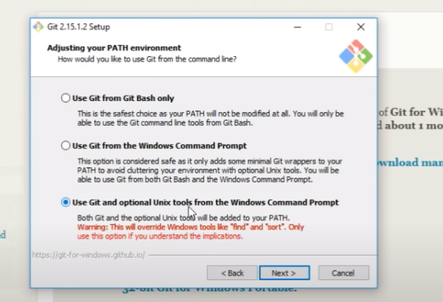

<!--Title-->
# Notas Git 2022

<!--Indice-->
 - [What is Git ?](#what-is-git)
 - [Concepts of Git](#concepts-of-git)
   - [Workspace(Working directory)](#workspaceworking-directory)
   - [Index(staging area)](#indexstaging-area)
   - [Local repository(Head)](#local-repositoryhead)
   - [Remote repository](#remote-repository)
 - [Basic commands](#basic-commands)
 - [How to install Git?](#how-to-install-git)

### What is git?

Version control system (VCS) for tracking changes in computer files

* Distributed veersion control
* Coordinate work between multiple developers
* Who made what changes and when
* Revert back any time
* Local & remote repos


### Concepts of Git

- Keeps track of code history
- Takes "snapshots" of your files
- You decide when to make snapshots by making a commit
- You can stage files before committing


#### **Workspace**(Working directory)

#### **Index**(staging area)

#### **Local repository**(Head)

#### **Remote repository**


###  Basic commands

- git init // empezar a utilizar git en el proyecto
- git add < file >  // agregar archivos al staging area
- git status // ver en que estado estan mis archivos
- git commit // pasarlo del staging area al repositioro (crear primer snapshot)
- git push // subirlo al repositorio remoto
- git pull // traer cambios que esten en el repositorio remoto
- git clone // hacer compia desde el servidor central donde esta el codigo a tu computador paraa empezarlo a trabajar

### How to install Git?

> Windows

:point_right: [Dowload](https://git-scm.com/download/win "instalar_git")

Tener en cuenta:


El resto de configuraciones dejar las que trae el instalador por defecto.

> Ubuntu(Linux)  

Escribir en la shell: 

```bash
$ sudo apt-get install git
```